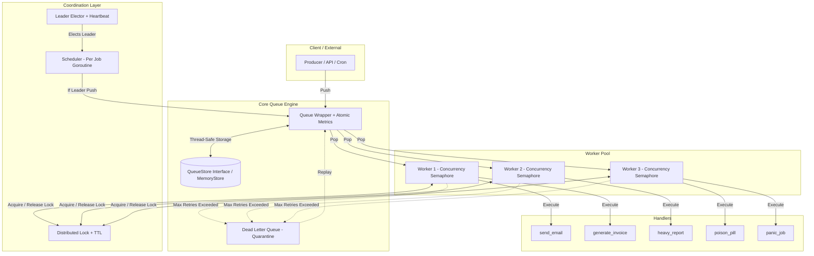

# Distributed Task Queue — Architecture & Technical Design Specification

This document details the complete architecture, Go concurrency primitives, component design rationales, data flow, failure recovery models, and engineering trade-offs of the Distributed Task Queue engine.

---

## 1. High-Level Architecture & System Diagram

The system is an **Asynchronous Task Processing Engine** built entirely with the Go standard library (`sync`, `sync/atomic`, `context`, `time`, `chan`) without third-party broker dependencies (Redis, RabbitMQ, Kafka, etc.).



---

## 2. Architectural Dependency Flow (Preventing Circular Imports)

The Go compiler disallows circular dependencies. Package dependencies strictly follow the **Dependency Inversion Principle (DIP)** in a single direction:

```
main.go (Orchestrator)
  │
  ├──► handlers/  ──► worker/ ──► queue/ (Task, QueueStore Interface, DLQ)
  │                      │          ▲
  ├──► scheduler/ ───────┘          │ (MemoryStore implements queue.QueueStore)
  │      │                          │
  │      └────────────► lock/      store/
  │
  └───────────────────► store/
```

- `queue/store.go` defines the storage contract (`QueueStore` interface).
- `store/memory.go` imports `queue` to implement this interface.
- `queue/queue.go` **never imports** `store/`; it interacts strictly through its internal `QueueStore` interface.

---

## 3. Deep-Dive Component Technical Breakdown

---

### 3.1. `queue/task.go` — Task Model & State Machine

Every executable unit of work is represented by a `Task` struct:

| Field | Type | Purpose |
|---|---|---|
| `ID` | `string` (UUID v4) | Unique identifier and **Distributed Lock key**. |
| `Name` | `string` | Routing identifier mapped to a registered `HandlerFunc`. |
| `Payload` | `map[string]any` | Execution parameters (JSON-compatible arbitrary data). |
| `Priority` | `int` | `1` (lowest) to `10` (critical). Dictates queue ordering. |
| `ExecuteAt` | `time.Time` | Schedule timestamp for delayed tasks and exponential backoff retry execution. |
| `MaxRetries` | `int` | Maximum retry threshold before routing to DLQ (Default: 3). |
| `Retries` | `int` | Current failure attempt count. |
| `Status` | `Status` (Enum) | `Pending` $\rightarrow$ `Running` $\rightarrow$ `Done` / `Failed` $\rightarrow$ `Dead`. |
| `Error` | `string` | Last captured error message (for debugging and DLQ inspection). |

#### Critical Method: `IsReady() bool`
```go
func (t *Task) IsReady() bool {
    now := time.Now()
    return now.After(t.ExecuteAt) || now.Equal(t.ExecuteAt)
}
```
During queue pops, tasks scheduled for future execution (`ExecuteAt > now`) remain preserved in the queue until their activation timestamp arrives.

---

### 3.2. `store/memory.go` — Thread-Safe In-Memory Storage Engine

The in-memory implementation of the `queue.QueueStore` interface.

- **`var _ queue.QueueStore = (*MemoryStore)(nil)`**: Compile-time interface verification.
- **Priority Sorting (`sort.SliceStable`)**: On `Push`, tasks are ordered by descending priority. Using `SliceStable` preserves **FIFO (First-In, First-Out)** order for tasks with identical priorities.
- **Delayed Task Filtering (`Pop`)**: `Pop()` scans the list and extracts the first task where `IsReady() == true`. Returns non-blocking `nil, false` when no eligible task is ready.
- **State Isolation (`Drain`)**: During shutdown, the internal slice is reset and a shallow `copy` is returned to eliminate external data mutation risks.

---

### 3.3. `queue/queue.go` — Lock-Free Metrics Layer

High-level wrapper around the underlying storage engine:
- `totalPushed` and `totalPopped` counters are tracked via `sync/atomic` primitives (`atomic.AddInt64`, `atomic.LoadInt64`).
- Provides nanosecond-level metric reads without mutex lock contention.

---

### 3.4. `queue/dlq.go` — Dead Letter Queue (Quarantine)

- **Problem:** Permanently broken tasks ("Poison Pills", e.g., missing database records or invalid API credentials) cause continuous failures, starving worker threads (**Head-of-Line Blocking**).
- **Solution:** Tasks exceeding `MaxRetries` are evicted from the primary queue and placed in isolated DLQ storage (`tasks []*Task`).
- **Methods**:
  - `Push(task)`: Marks the task as `Dead` and records the failure error.
  - `All()`: Returns a defensive slice `copy` for monitoring and administrative inspection.
  - `Replay(q *Queue)`: Resets state (`Retries = 0`, `Status = Pending`, `Error = ""`, `ExecuteAt = Now`) and re-enqueues dead tasks once external issues are resolved.

---

### 3.5. `lock/distlock.go` — Distributed Lock & TTL (At-Most-Once Guarantee)

Guarantees mutual exclusion when multiple workers consume from the queue, preventing **Double Execution**.

```go
type lockEntry struct {
    holderID  string
    expiresAt time.Time
}
```

1. **`Acquire(resource, holderID, ttl)`**:
   - Grants lease if the resource is unlocked.
   - If locked but expired (**Lazy Stale Expiry**), evicts stale owner and grants lease to the new caller without background timer goroutines.
   - Returns `false` if currently held under a valid lease.
2. **`Release(resource, holderID)`**:
   - **Non-owner protection:** Only the current leaseholder `holderID` can release the lock. External callers cannot unlock other workers' leases.
3. **`IsHeld(resource)`**:
   - Checks whether a valid, non-expired lease is currently active.

---

### 3.6. `scheduler/leader.go` — Leader Election & Contention Protection

Ensures that scheduled cron jobs execute on exactly **one** leader node, preventing duplicate job generation across multiple worker instances.

- **`Campaign(id string) bool`**:
  - Claims leadership if vacant or if the previous leader's heartbeat expired (`isLeaderDead`).
  - Automatically issues an immediate initial `Heartbeat` upon election.
- **`Heartbeat(id string)`**: Updates the last known alive timestamp (`time.Now()`) on a concurrent `sync.Map`.
- **Automatic Failover**: If the active leader fails to heartbeat within `leaderTTL`, subsequent `Campaign()` calls elect a new leader.
- **Atomic Leader Reads**: Provides lock-free queries via `currentLeader.Load()`.

---

### 3.7. `scheduler/scheduler.go` — Independent Job Scheduler

- Manages periodic jobs (`ScheduledJob`), each running on its own configured interval (`time.Duration`).
- `Start(ctx)` launches dedicated goroutines with independent `time.Ticker` instances.
- **Leadership Filter:** Each ticker tick validates `elector.IsLeader(s.workerID)`. Non-leader nodes skip job dispatch.
- **Goroutine Variable Capture Safety:** Passes loop variables explicitly by value (`go func(j ScheduledJob)`).

---

### 3.8. `worker/worker.go` — Worker Engine & Concurrency Control

Core execution engine responsible for polling, concurrency bounding, panic isolation, and backoff retries.

```
Worker Run Loop:
  1. Check ctx.Done() (Graceful shutdown signal)
  2. queue.Pop() -> If empty, sleep 100ms (CPU throttling)
  3. distLock.Acquire() -> If busy, requeue task and continue
  4. sem <- struct{}{}  -> Await available semaphore slot (Concurrency Ceiling)
  5. wg.Add(1)
  6. go process(ctx, task)
```

#### Critical `defer` LIFO Ordering (Last-In, First-Out)
The `defer` stack in `process()` is ordered with strict mathematical precision:

```go
func (w *Worker) process(ctx context.Context, task *queue.Task) {
    // 4. Runs Fourth (Last): Decrement WaitGroup counter
    defer w.wg.Done()

    // 3. Runs Third: Release concurrency semaphore slot
    defer func() { <-w.sem }()

    // 2. Runs Second: Release Distributed Lock lease
    defer w.lock.Release(task.ID, w.ID)

    // 1. Runs First: Capture panics via recover()
    defer func() {
        if r := recover(); r != nil {
            task.Error = fmt.Sprintf("panic: %v", r)
            atomic.AddInt64(&w.panicked, 1)
            w.handleFailure(task)
        }
    }()
    // ...
}
```

#### Execution Order Rationale:
1. When a handler panics, the **recover block executes first**. The panic is captured, and the task is dispatched to retry/DLQ handling.
2. The lock lease is released second (`lock.Release`).
3. The concurrency semaphore slot is vacated third (`<-w.sem`), admitting the next pending task.
4. `w.wg.Done()` decrements last, ensuring `GracefulStop` never exits prematurely while cleanup logic is in flight.

#### Exponential Backoff Calculation
In `handleFailure(task)`:
$$\text{Backoff Delay} = 2^{\text{Retries}} \text{ seconds}$$
- Attempt 1: $2^1 = 2\text{s}$ delay.
- Attempt 2: $2^2 = 4\text{s}$ delay.
- Attempt 3: $2^3 = 8\text{s}$ delay.
- If $\text{Retries} \ge \text{MaxRetries}$: `task.Status = Dead` $\rightarrow$ `dlq.Push(task)`.

---

### 3.9. `worker/pool.go` — Pool Orchestration & Graceful Shutdown

Coordinates multiple worker instances through a unified lifecycle:

```go
func (p *WorkerPool) GracefulStop() {
    p.wg.Wait()
    fmt.Println("[WorkerPool] All workers stopped cleanly.")
}
```
1. `SIGTERM` / `SIGINT` signal received.
2. Context `cancel()` is triggered $\rightarrow$ Worker polling loops halt new task consumption.
3. Each worker waits for all active `process()` goroutines to complete (`w.wg.Wait()`).
4. The pool waits for all workers to shut down cleanly (`pool.wg.Wait()`).
5. Process exits cleanly with zero data loss (`exit 0`).

---

## 4. Testing Architecture & Validation Results

The system is verified across a 3-tier validation matrix:

### 4.1. Unit Tests & Statement Coverage (`go test -cover ./...`)
- **`store`**: 100.0% statement coverage (50-goroutine concurrent push, priority sorting, delay filtering, drain isolation).
- **`lock`**: 92.3% statement coverage (20-goroutine contention winner, non-owner release rejection, TTL expiry handoff).
- **`scheduler`**: 91.4% statement coverage (Single leader election, failover mechanics, background heartbeat verification).
- **`worker`**: 87.2% statement coverage (Execution pipeline, concurrency semaphore bounds, panic recovery, timeout cancellation).
- **`queue`**: 76.8% statement coverage (Quarantine state, DLQ deduplication, replay, and clear workflows).
- **`handlers`**: 67.9% statement coverage (Production handler scenarios and simulated failure paths).

*Core domain packages maintain an average ~89% statement coverage, with all edge cases verified under the Go race detector (`-race`).*

### 4.2. Stress & Data Integrity Testing (`test/stress_test.go`)
- **`TestStress10kTasksNoLoss`**: 50 producers, 5 workers, 100 concurrent slots processing 5,000 mixed-workload tasks.
  $$\text{Verified Conservation: } 5,000 \text{ Injected} == 4,000 \text{ Completed} + 1,000 \text{ DLQ} + 0 \text{ Remaining}$$
  **Result: Zero data loss, zero task leakage.**
- **`TestStressConcurrencyCeiling`**: Burst of 300 tasks sent to a worker bounded at 25 concurrency slots; verifies active executing goroutines strictly never exceed 25.

### 4.3. Fault Injection & Edge-Case Testing (`test/chaos_test.go`)
- **`TestChaosShutdownUnderFire`**: Cancels context while 45 goroutines are actively executing under full load; `GracefulStop` finishes cleanly within 120ms with zero deadlocks.
- **`TestChaosSplitBrainFlapping` (Leader Contention & Flapping)**: 10 concurrent node routines campaign simultaneously while dropping heartbeats; verifies atomic state transitions never allow $\gt 1$ concurrent leader.
- **`TestChaosPanicStorm`**: Injects 100 consecutive panicked tasks; proves worker pool survives without process termination, quarantines panics to DLQ, and resumes healthy task processing.

### 4.4. Benchmark Performance Metrics (`test/benchmark_test.go`)

Ran on Intel Core i5-12400F:

| Component / Benchmark | Throughput | Latency | Memory Allocation |
|---|---|---|---|
| **`BenchmarkInMemoryDistLockSim (Acquire + Release)`** | **~12,543,312 ops/sec** | `94.1 ns/op` | `0 B/op (0 allocs)` |
| **`Queue (Push + Pop)`** | **~2,115,703 ops/sec** | `575.8 ns/op` | `232 B/op (4 allocs)` |

> [!NOTE]
> **Engineering Scope Disclaimer**: `BenchmarkInMemoryDistLockSim` measures the raw execution speed and zero-allocation (`0 B/op`, `0 allocs/op`) performance of our in-memory `sync.Mutex` + TTL lease algorithm. It does not include network TCP/gRPC roundtrips or wire serialization overhead typical of remote Redis/etcd clusters.

---

## 5. System Design & Technical Interview Q&A (Cheat Sheet)

#### Q: Do you guarantee "At-least-once" or "At-most-once" delivery?
> **A:** At the queue level, we provide `At-least-once` delivery (failed tasks are retried with exponential backoff). At the worker execution level, `DistributedLock` enforces `At-most-once` execution for any given task ID, preventing concurrent duplicate runs.

#### Q: What is "Head-of-Line Blocking", and how is it resolved?
> **A:** It occurs when a broken task at the front of a queue repeatedly fails, blocking subsequent healthy tasks. We resolve this by enforcing a `MaxRetries` threshold and routing poison pills to an isolated `DLQ (Dead Letter Queue)`.

#### Q: What happens if a worker crashes while holding a lock? Will it cause a deadlock?
> **A:** No. Locks carry a `TTL (Time-To-Live)`. When another worker calls `Acquire()`, expired locks are detected and lazily evicted (`lazy stale expiry`) without requiring background cleanup goroutines.

#### Q: How would this architecture transition to a multi-node production deployment?
> **A:**
> 1. Swap `MemoryStore` with a Redis or PostgreSQL `QueueStore` adapter.
> 2. Back `DistributedLock` with Redis Redlock or etcd Leases.
> 3. Persist `DLQ` records into a durable PostgreSQL table.
> 4. Thanks to Go's interface-driven design, the `Worker` and `Scheduler` codebases require zero modifications to support distributed storage backends.
