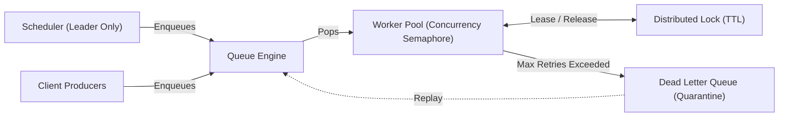

# Distroqueue — Distributed Task Queue Engine in Pure Go

Distroqueue is a high-performance, fault-tolerant, in-memory **Distributed Task Queue Engine** built from scratch using pure Go concurrency primitives.

---

## Key Features

- **High Throughput Core:** In-memory queue achieving **>2.1 Million Push/Pop ops/sec**.
- **Distributed Lock (TTL-based):** High-speed mutual exclusion primitive with Time-To-Live (TTL), lazy lease expiry, and non-owner release protection (0 heap allocs, **>12.5M ops/sec** in-memory simulation).
- **Leader Election & Failover:** Atomic leader election with continuous heartbeating and automatic failover for single-scheduler consistency.
- **Fault Tolerance & DLQ:** Poison-pill quarantine via **Dead Letter Queue**, panic recovery isolation, and exponential backoff retries ($2^{\text{retries}}\text{s}$).
- **Concurrency Limiting:** Channel-based semaphore concurrency control per worker.
- **Zero-Loss Graceful Shutdown:** Full in-flight task completion with `SIGTERM`/`SIGINT` traps and comprehensive shutdown reporting.
- **Extensively Validated:** High core statement coverage (~89% core avg: `store` 100%, `lock` 92%, `scheduler` 91%, `worker` 87%), 5,000-task concurrent stress testing, fault-injection tests, and 0 data races (`-race`).

---

## Architecture



For complete technical deep dive, LIFO defer orderings, data structures, and trade-offs, see **[ARCHITECTURE.md](ARCHITECTURE.md)**.

---

## Fault Injection & Edge-Case Testing

The test suite explicitly simulates harsh concurrency failure modes:
1. **Shutdown Under Load (`TestChaosShutdownUnderFire`):** Cancels worker context while 45 concurrent producers/workers are actively pushing and processing. Asserts all in-flight jobs finish gracefully within timeout without deadlocks or goroutine leaks.
2. **Leader Contention & Flapping (`TestChaosSplitBrainFlapping`):** 10 concurrent node routines vigorously campaign, send short heartbeat bursts, and drop leases to trigger failover races. Asserts that atomic state transitions never allow >1 leader simultaneously.
3. **Panic Storms (`TestChaosPanicStorm`):** Injects 100 consecutive panicked tasks into the worker pool. Asserts worker goroutines recover cleanly, isolate broken jobs to the DLQ, and continue processing healthy jobs uninterrupted.

---

## Quick Start

### Prerequisites
- Go 1.21+ (Tested on Go 1.22+)

### Run Live Demo
```bash
go run -race main.go
```

### Run All Tests with Race Detector
```bash
go test -v -race ./...
```

### Run High-Load Stress & Chaos Tests
```bash
go test -v -race ./test/...
```

### Run Benchmarks
```bash
go test -run=^$ -bench=. -benchmem ./test
```

---

## Benchmark Results

Ran on Intel Core i5-12400F:

| Benchmark | Throughput | Latency | Memory / Op |
|---|---|---|---|
| `BenchmarkInMemoryDistLockSim` | **12,543,312 ops/sec** | `94.1 ns/op` | `0 B/op (0 allocs)` |
| `BenchmarkQueuePushPop` | **2,115,703 ops/sec** | `575.8 ns/op` | `232 B/op (4 allocs)` |

> [!NOTE]
> **Honest Scope Disclaimer**: `BenchmarkInMemoryDistLockSim` measures the raw synchronization and TTL algorithm throughput of our in-memory core engine primitive (`sync.Mutex` + lease tracking without heap allocations). It does **not** include network I/O or TCP roundtrips typical of remote Redis/etcd clusters.

---

## Project Structure

```
├── main.go               # Orchestrator entrypoint, demo seed, signal traps
├── queue/                # Core queue types, Task model, QueueStore interface, DLQ
├── store/                # MemoryStore (thread-safe, priority-sorted driver)
├── lock/                 # DistributedLock (TTL-based mutual exclusion)
├── scheduler/            # LeaderElector (atomic + heartbeats) & Scheduler
├── worker/               # Worker (semaphore, retry engine) & WorkerPool
├── handlers/             # Production scenario handlers (email, invoice, report, panic...)
├── test/                 # Stress tests (5K tasks), Chaos tests, and Benchmarks
├── ARCHITECTURE.md       # Comprehensive technical documentation
└── README.md
```

---

## License
MIT License.
